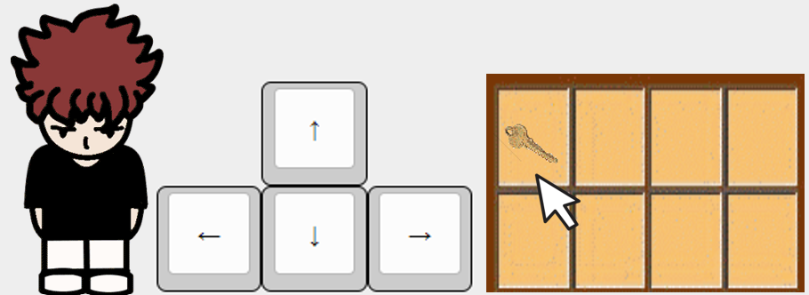

# 消失的礦工

這遊戲原本是以前在用VB製作專題時寫的遊戲，現在用網頁復刻，也改良了一些寫法和bug，並支援電腦和部分手機版。

這個劇情全是自己想的，所以可能有點奇怪。而素材大部分是從 Minecraft 材質包和 The Orphanage 地圖拿來用的，追逐的音樂是青鬼，部分角色為原創(就是看起來像用小畫家畫的那些)，BGM 忘記叫什麼了，以前找的。

## 規則

根據你的直覺，走出你的決定，有5個結局。

## 控制方式

## 遊戲連結

## 遊戲封面

